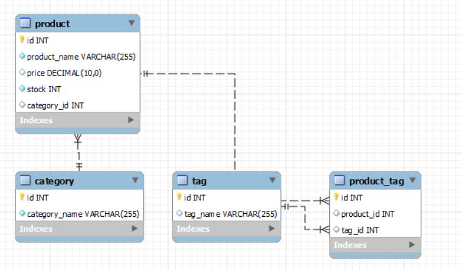
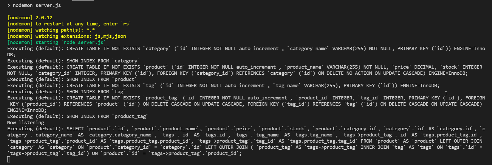
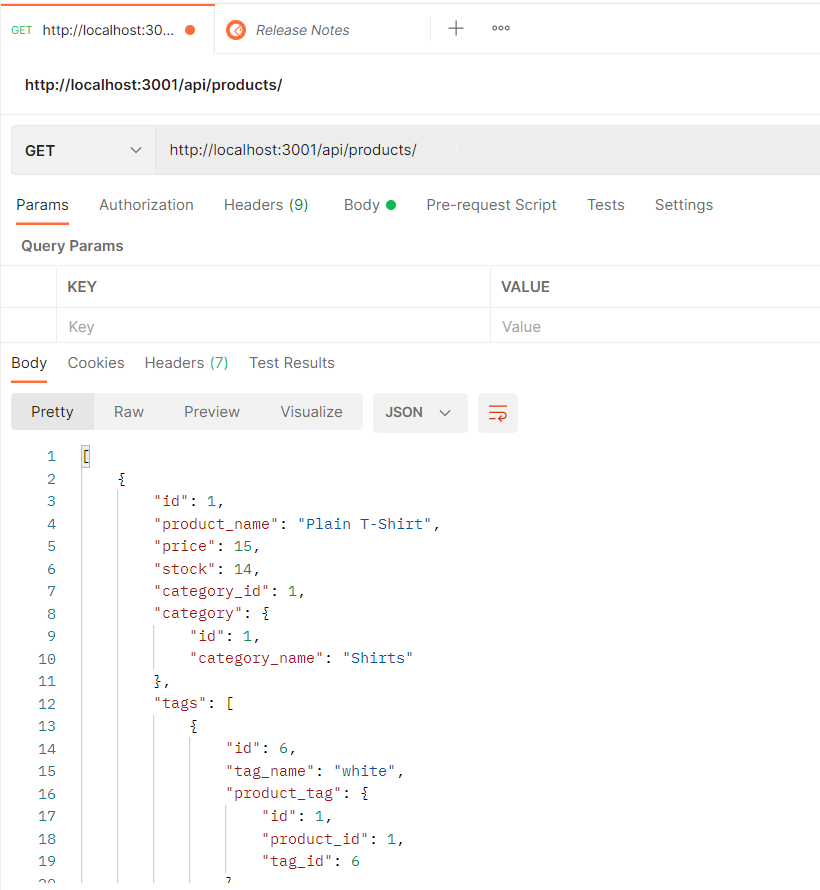

# 13 Ecommerce API using Node/Express, Sequelize, MySQL

This app is a server side REST API created with Node and Express using a relational database (MySQL) and Sequelize for an ecommerce store. It uses 4 tables, Category, Product, Tag, ProductTag to create the schema below. These tables are generated using sequelize models located in the `./models` folder. The API routes associated with these tables are in the `./api` folder but are called  from `./routes/index.js` when `server.js` is run. CRUD functionality is available for each table and their relational connections.

## Database Schema

## Installation

1. At the root of the project in the command line use the command `npm install` to download the projects dependencies.
1.  Run the script in `./db/schema.sql` to create the MySQL database as Sequelize won't do this step. This can be done via MySQL shell or a tool like MySQL Workbench.
1. Connect the project using the `.env.EXAMPLE` file by filling out your credentials and then renaming the file to `.env`. The database being generated is called `ecommerce_db`
1. At the root of the project on the command line use the command `npm run seed` to create the database and seed it with data. Notice the custom script commands in `./package.json`.
1. Now the server app can be run. For development use command `npm run watch` to use nodemon or use `npm run start` to run directly. 
1. Finally either use the browser or a REST client like Postman to test the API endpoints. For example GET: `http://localhost:3001/api/products/`. Note that the host can be updated in `./config.connection,js` where Sequelize connects to your MySQL database. 

## Screenshots

----------------

//walkthrough video
//URL of the GitHub repository
//update project comments

Fill out the unfinished routes in `product-routes.js`, `tag-routes.js`, and `category-routes.js` to perform create, read, update, and delete operations using your Sequelize models.

* The walkthrough video must show all of the technical acceptance criteria being met.

* The walkthrough video must demonstrate how to create the schema from the MySQL shell.

* The walkthrough video must demonstrate how to seed the database from the command line.

* The walkthrough video must demonstrate how to start the application’s server.

* The walkthrough video must demonstrate GET routes for all categories, all products, and all tags being tested in Insomnia Core.

* The walkthrough video must demonstrate GET routes for a single category, a single product, and a single tag being tested in Insomnia Core.

* The walkthrough video must demonstrate POST, PUT, and DELETE routes for categories, products, and tags being tested in Insomnia Core.

